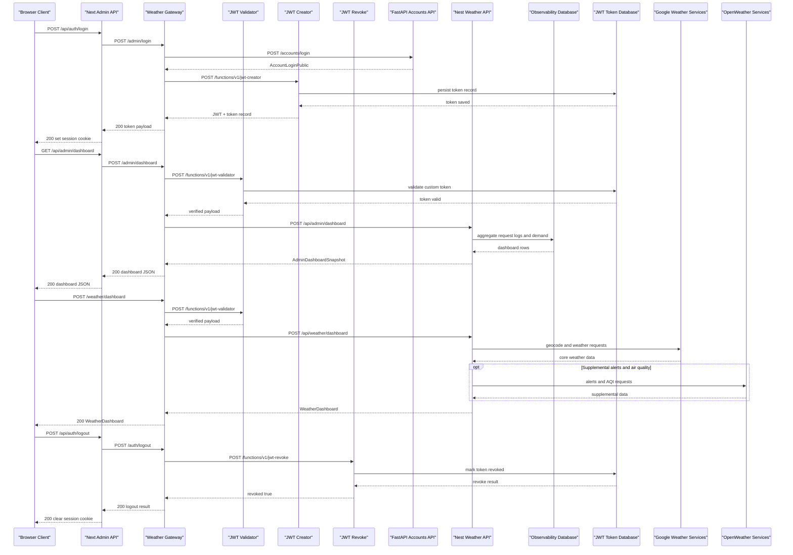

# API & Service Communication Contracts

Codyza Weather exposes a multi-layer API surface: a public Supabase Edge gateway, private NestJS and FastAPI upstream services, internal Next.js admin routes, and JWT utility edge functions. The platform is overwhelmingly synchronous HTTP-based, with server-sent events used for live admin updates and targeted retry logic used at gateway and admin proxy boundaries.

## Service Catalog

| Service | Port | Category | Purpose |
|---|---|---|---|
| Supabase weather-gateway edge function | `54321/functions/v1/weather-gateway` | API Layer | Public gateway for auth, weather, profile, history, and admin proxy traffic |
| Supabase jwt-creator edge function | Supabase functions runtime | Infrastructure | Mints internal custom JWTs for weather/admin sessions and persists token records |
| Supabase jwt-validator edge function | Supabase functions runtime | Infrastructure | Validates Supabase or custom JWTs before protected gateway forwarding |
| Supabase jwt-revoke edge function | Supabase functions runtime | Infrastructure | Revokes persisted custom JWTs on logout |
| NestJS weather API | `3000` default with `/api` prefix | Business | Weather search, reverse geocoding, dashboard aggregation, profile persistence, search history, and admin observability snapshot/stream |
| FastAPI registration API | `8000` | Business | Account registration, login, role lookup, password setup, password reset request, and password reset confirmation |
| Next.js admin internal API | `3000` local default | API Layer | Cookie-backed admin BFF that proxies admin auth and dashboard routes to the public gateway |

## API Endpoints Inventory

| Service | Method | Path | Request Type | Response Type |
|---|---|---|---|---|
| weather-gateway | GET | `/health` | none | health JSON / simple status response |
| weather-gateway | POST | `/accounts` | `AccountBase`-style JSON body | account creation result |
| weather-gateway | POST | `/accounts/access` | email lookup JSON body | account access state |
| weather-gateway | POST | `/accounts/login` | email/password JSON body + Turnstile token | custom JWT + token record |
| weather-gateway | POST | `/accounts/password/setup` | `AccountPasswordSetup`-style JSON body | custom JWT + token record |
| weather-gateway | POST | `/accounts/reset-password` | password reset request JSON body | password reset acceptance / preview URL |
| weather-gateway | POST | `/accounts/reset-password/confirm` | password reset confirm JSON body | password reset completion |
| weather-gateway | POST | `/accounts/deactivate` | authenticated bearer token | account deletion confirmation |
| weather-gateway | PUT/PATCH/DELETE | `/accounts/{id}` | path id + account JSON body for updates | updated or deleted account result |
| weather-gateway | POST | `/auth/logout` | bearer token | token revoke result |
| weather-gateway | GET | `/weather/status` | none | provider configuration status |
| weather-gateway | GET | `/weather/search?query=` | query parameter | `WeatherLocation[]` |
| weather-gateway | GET | `/weather/reverse?lat=&lon=&source=` | query parameters | `WeatherLocation[]` |
| weather-gateway | POST | `/weather/dashboard` | `DashboardRequestBody` | `WeatherDashboard` |
| weather-gateway | GET | `/weather/map-layers/{layer}/{z}/{x}/{y}` | path parameters | tile binary stream |
| weather-gateway | GET/POST/DELETE | `/weather/search-history` | header-authenticated request, optional `SaveSearchHistoryRequestBody` | recent searches list / saved item / clear result |
| weather-gateway | GET/PUT | `/weather/profile` | header-authenticated request, `SaveWeatherUserProfileRequestBody` for PUT | `WeatherUserProfile` |
| weather-gateway | POST | `/admin/access` | admin email lookup JSON body | admin access state |
| weather-gateway | POST | `/admin/login` | admin email/password JSON body + Turnstile token | custom JWT + token record |
| weather-gateway | POST | `/admin/create-password` | admin email/password JSON body | custom JWT + token record |
| weather-gateway | POST | `/admin/dashboard` | bearer token | `AdminDashboardSnapshot` |
| weather-gateway | GET | `/admin/dashboard/stream` | bearer token | SSE `AdminDashboardStreamPayload` |
| NestJS weather API | GET | `/api` | none | `"Codyza Weather API"` |
| NestJS weather API | GET | `/api/weather/status` | none | provider status JSON |
| NestJS weather API | GET | `/api/weather/search` | query parameter `query` | `WeatherLocation[]` |
| NestJS weather API | GET | `/api/weather/reverse` | query parameters `lat`, `lon`, optional `source` | `WeatherLocation[]` |
| NestJS weather API | POST | `/api/weather/dashboard` | `DashboardRequestBody` | `WeatherDashboard` |
| NestJS weather API | GET | `/api/weather/map-layers/:layer/:z/:x/:y` | path parameters | tile binary stream |
| NestJS weather API | GET/POST/DELETE | `/api/weather/search-history` | `x-user-id` header, optional `SaveSearchHistoryRequestBody` | search history result |
| NestJS weather API | GET/PUT/DELETE | `/api/weather/profile` | `x-user-id` header, `SaveWeatherUserProfileRequestBody` for PUT | `WeatherUserProfile` or deletion confirmation |
| NestJS weather API | POST | `/api/admin/dashboard` | trusted gateway headers + admin payload header | `AdminDashboardSnapshot` |
| NestJS weather API | GET | `/api/admin/dashboard/stream` | trusted gateway headers + admin payload header | SSE dashboard events |
| FastAPI registration API | GET | `/health` | none | health JSON |
| FastAPI registration API | POST | `/accounts/` | `AccountBase` | `AccountPublic` |
| FastAPI registration API | POST | `/accounts/access` | `AccountEmailLookup` | `AccountLoginPublic` |
| FastAPI registration API | POST | `/accounts/login` | `AccountBase` | `AccountLoginPublic` |
| FastAPI registration API | POST | `/accounts/password/setup` | `AccountPasswordSetup` | `AccountLoginPublic` |
| FastAPI registration API | POST | `/accounts/reset-password` | `AccountPasswordResetRequest` | `AccountPasswordResetRequestedPublic` |
| FastAPI registration API | POST | `/accounts/reset-password/confirm` | `AccountPasswordResetConfirm` | `AccountPasswordResetCompletedPublic` |
| FastAPI registration API | POST | `/accounts/deactivate` | `AccountDeactivationRequest` | `AccountDeactivatedPublic` |
| FastAPI registration API | PUT | `/accounts/{id}` | path id + `AccountBase` | `AccountPublic` |
| FastAPI registration API | PATCH | `/accounts/{id}` | path id + `AccountUpdate` | `AccountPublic` |
| FastAPI registration API | DELETE | `/accounts/{id}` | path id | `AccountPublic` |
| Next.js admin internal API | POST | `/api/auth/access` | `{ email }` JSON body | admin access JSON |
| Next.js admin internal API | POST | `/api/auth/login` | `{ email, password, turnstileToken }` JSON body | `{ ok: true }` + session cookie |
| Next.js admin internal API | POST | `/api/auth/create-password` | `{ email, password }` JSON body | `{ ok: true }` + session cookie |
| Next.js admin internal API | POST | `/api/auth/logout` | session cookie / bearer forwarding | `{ ok: true }` |
| Next.js admin internal API | GET/POST | `/api/admin/dashboard` | admin session cookie | admin dashboard JSON |
| Next.js admin internal API | GET | `/api/admin/dashboard/stream` | admin session cookie | proxied SSE stream |
| jwt-creator | POST | `/functions/v1/jwt-creator` | `{ userId?, role? }` | custom JWT + token metadata |
| jwt-validator | POST | `/functions/v1/jwt-validator` | bearer token | verified payload + token type |
| jwt-revoke | POST | `/functions/v1/jwt-revoke` | bearer token or `{ tokenId }` | revoke result |

## Management & Observability Endpoints

| Service | Endpoint | Custom Metrics (if any) |
|---|---|---|
| weather-gateway | `/health` | Basic gateway health response |
| NestJS weather API | `/api/weather/status` | Provider configuration status |
| NestJS weather API | `/api/admin/dashboard` | Request totals, failures, cache performance, active users, demand, system health |
| NestJS weather API | `/api/admin/dashboard/stream` | Realtime SSE feed |
| FastAPI registration API | `/health` | Basic API health |
| FastAPI registration API | `/docs` | Swagger UI |
| FastAPI registration API | `/redoc` | ReDoc |
| FastAPI registration API | `/openapi.json` | OpenAPI JSON |
| Next.js admin internal API | `/api/admin/dashboard` | Authenticated BFF wrapper around gateway dashboard |
| Next.js admin internal API | `/api/admin/dashboard/stream` | Authenticated BFF wrapper around gateway SSE |

## DTOs & Contracts

- Gateway-level contracts include `AdminDashboard`, `AdminDashboardStreamPayload`, gateway login/create-password token responses, and `VerifiedToken`.
- FastAPI request models include `AccountBase`, `AccountEmailLookup`, `AccountPasswordSetup`, `AccountPasswordResetRequest`, `AccountPasswordResetConfirm`, and `AccountUpdate`; responses include `AccountPublic`, `AccountLoginPublic`, `AccountPasswordResetRequestedPublic`, and `AccountPasswordResetCompletedPublic`.
- NestJS weather contracts include `DashboardRequestBody`, `SaveSearchHistoryRequestBody`, `SaveWeatherUserProfileRequestBody`, `WeatherDashboard`, `WeatherLocation`, and `WeatherUserProfile`.
- JWT utility contracts include `JwtCreatorRequestBody`, `TokenRecordPayload`, and validation/revocation result payloads.
- No standalone OpenAPI YAML, protobuf, or GraphQL schema was found. FastAPI provides runtime OpenAPI docs.

## Communication Patterns

- Browser traffic goes first to `weather-gateway` or the Next.js admin BFF.
- The gateway synchronously composes FastAPI account calls, NestJS weather/admin calls, and JWT utility edge calls.
- NestJS weather aggregation synchronously combines Google weather/geocoding data with supplemental OpenWeather data.
- Next.js admin route handlers proxy to the gateway and retry transient failures with 3 attempts and 250ms incremental backoff for 502/503/504 and network errors.
- SSE is used for `/admin/dashboard/stream`; no queue or message broker was found.
- No explicit circuit breaker or bulkhead implementation was found.
- Security posture: HTTPS in production, HTTP locally; gateway-based bearer validation; trusted internal headers for NestJS protected routes; admin role enforcement in NestJS; JWT utility functions locked to gateway-secret callers.

## Service Technology Matrix

| Service | Web | Data Access | Discovery | Gateway | Actuator | Cache | Metrics |
|---|---|---|---|---|---|---|---|
| weather-gateway | Deno edge handler | none direct | env URLs | yes | `/health` | no | basic logging |
| jwt-creator | Deno edge handler | PostgreSQL token store | env URLs | no | none | no | token persistence telemetry |
| jwt-validator | Deno edge handler | PostgreSQL token store | env URLs | no | none | no | validation telemetry |
| jwt-revoke | Deno edge handler | PostgreSQL token store | env URLs | no | none | no | revoke telemetry |
| NestJS weather API | NestJS controllers | PostgreSQL via `pg` | none | no | `/api/weather/status` | yes | admin and cache metrics |
| FastAPI registration API | FastAPI | SQLModel / SQLAlchemy | none | no | `/health`, `/docs`, `/redoc` | no | framework docs |
| Next.js admin internal API | Next.js route handlers | none direct | env URLs | BFF only | dashboard proxy routes | no | none direct |

## Service Communication Sequence

<!-- mermaid-checked: every participant uses `participant Id as "Label"`, no \n in aliases/messages/notes, every alt/opt/loop closed by end, no `:` inside any alias -->

