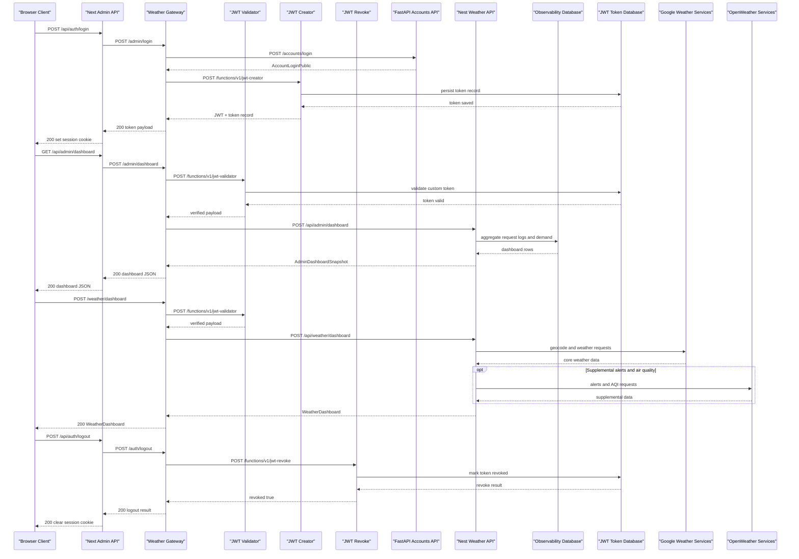

# API & Service Communication Contracts

Codyza Weather exposes a multi-layer API surface: a public Supabase Edge gateway, private NestJS and FastAPI upstream services, internal Next.js admin routes, and JWT utility edge functions. The platform is overwhelmingly synchronous HTTP-based, with server-sent events used for live admin updates and targeted retry logic used at gateway and admin proxy boundaries.

## Service Catalog

| Service | Default Port / Base | Category | Purpose | Key Framework Dependencies |
|---|---|---|---|---|
| Supabase weather-gateway edge function | `http://localhost:54321/functions/v1/weather-gateway` | API Layer | Public gateway for auth, weather, profile, history, and admin proxy traffic | Supabase Edge Runtime, Deno Fetch |
| Supabase jwt-creator edge function | Supabase functions runtime | Infrastructure | Mints internal custom JWTs for weather/admin sessions and persists token records | Deno, `jose` |
| Supabase jwt-validator edge function | Supabase functions runtime | Infrastructure | Validates Supabase or custom JWTs before protected gateway forwarding | Deno, `jose` |
| Supabase jwt-revoke edge function | Supabase functions runtime | Infrastructure | Revokes persisted custom JWTs on logout | Deno, `jose` |
| NestJS weather API | `PORT` or `3000`, global prefix `/api` | Business | Weather search, reverse geocoding, dashboard aggregation, profile persistence, search history, and admin observability snapshot/stream | NestJS, `pg`, `cache-manager`, RxJS |
| FastAPI registration API | `8000` | Business | Account registration, login, role lookup, password setup, password reset request, and password reset confirmation | FastAPI, SQLModel, SQLAlchemy, Pydantic |
| Next.js admin internal API | Next.js app server, local default `3000` | API Layer | Cookie-backed admin BFF that proxies admin auth and dashboard routes to the public gateway | Next.js route handlers |

## API Endpoints Inventory

| Service | Method | Path | Request Type | Response Type |
|---|---|---|---|---|
| weather-gateway | GET | `/health` | none | health JSON / simple status response |
| weather-gateway | POST | `/accounts` | `AccountBase`-style JSON body | account creation result |
| weather-gateway | POST | `/accounts/access` | email lookup JSON body | account access state |
| weather-gateway | POST | `/accounts/login` | email/password JSON body | custom JWT + token record |
| weather-gateway | POST | `/accounts/password/setup` | `AccountPasswordSetup`-style JSON body | custom JWT + token record |
| weather-gateway | POST | `/accounts/reset-password` | password reset request JSON body | password reset acceptance / preview URL |
| weather-gateway | POST | `/accounts/reset-password/confirm` | password reset confirm JSON body | password reset completion |
| weather-gateway | POST | `/accounts/deactivate` | authenticated bearer token | account deletion confirmation |
| weather-gateway | PUT/PATCH/DELETE | `/accounts/{id}` | path id + account JSON body for updates | updated or deleted account result |
| weather-gateway | POST | `/auth/logout` | bearer token | token revoke result |
| weather-gateway | GET | `/weather/status` | none | provider configuration status |
| weather-gateway | GET | `/weather/search?query=` | query parameter | `WeatherLocation[]` |
| weather-gateway | GET | `/weather/reverse?lat=&lon=&source=` | query parameters | `WeatherLocation[]` |
| weather-gateway | POST | `/weather/dashboard` | `DashboardRequestBody` | `WeatherDashboard` |
| weather-gateway | GET | `/weather/map-layers/{layer}/{z}/{x}/{y}` | path parameters | tile binary stream |
| weather-gateway | GET/POST/DELETE | `/weather/search-history` | header-authenticated request, optional `SaveSearchHistoryRequestBody` | recent searches list / saved item / clear result |
| weather-gateway | GET/PUT | `/weather/profile` | header-authenticated request, `SaveWeatherUserProfileRequestBody` for PUT | `WeatherUserProfile` |
| weather-gateway | POST | `/admin/access` | admin email lookup JSON body | admin access state |
| weather-gateway | POST | `/admin/login` | admin email/password JSON body | custom JWT + token record |
| weather-gateway | POST | `/admin/create-password` | admin email/password JSON body | custom JWT + token record |
| weather-gateway | POST | `/admin/dashboard` | bearer token | `AdminDashboardSnapshot` |
| weather-gateway | GET | `/admin/dashboard/stream` | bearer token | SSE `AdminDashboardStreamPayload` |
| NestJS weather API | GET | `/api` | none | `"Codyza Weather API"` |
| NestJS weather API | GET | `/api/weather/status` | none | provider status JSON |
| NestJS weather API | GET | `/api/weather/search` | query parameter `query` | `WeatherLocation[]` |
| NestJS weather API | GET | `/api/weather/reverse` | query parameters `lat`, `lon`, optional `source` | `WeatherLocation[]` |
| NestJS weather API | POST | `/api/weather/dashboard` | `DashboardRequestBody` | `WeatherDashboard` |
| NestJS weather API | GET | `/api/weather/map-layers/:layer/:z/:x/:y` | path parameters | tile binary stream |
| NestJS weather API | GET/POST/DELETE | `/api/weather/search-history` | `x-user-id` header, optional `SaveSearchHistoryRequestBody` | search history result |
| NestJS weather API | GET/PUT/DELETE | `/api/weather/profile` | `x-user-id` header, `SaveWeatherUserProfileRequestBody` for PUT | `WeatherUserProfile` or deletion confirmation |
| NestJS weather API | POST | `/api/admin/dashboard` | trusted gateway headers + admin payload header | `AdminDashboardSnapshot` |
| NestJS weather API | GET | `/api/admin/dashboard/stream` | trusted gateway headers + admin payload header | SSE dashboard events |
| FastAPI registration API | GET | `/health` | none | health JSON |
| FastAPI registration API | POST | `/accounts/` | `AccountBase` | `AccountPublic` |
| FastAPI registration API | POST | `/accounts/access` | `AccountEmailLookup` | `AccountLoginPublic` |
| FastAPI registration API | POST | `/accounts/login` | `AccountBase` | `AccountLoginPublic` |
| FastAPI registration API | POST | `/accounts/password/setup` | `AccountPasswordSetup` | `AccountLoginPublic` |
| FastAPI registration API | POST | `/accounts/reset-password` | `AccountPasswordResetRequest` | `AccountPasswordResetRequestedPublic` |
| FastAPI registration API | POST | `/accounts/reset-password/confirm` | `AccountPasswordResetConfirm` | `AccountPasswordResetCompletedPublic` |
| FastAPI registration API | POST | `/accounts/deactivate` | `AccountDeactivationRequest` | `AccountDeactivatedPublic` |
| FastAPI registration API | PUT | `/accounts/{id}` | path id + `AccountBase` | `AccountPublic` |
| FastAPI registration API | PATCH | `/accounts/{id}` | path id + `AccountUpdate` | `AccountPublic` |
| FastAPI registration API | DELETE | `/accounts/{id}` | path id | `AccountPublic` |
| Next.js admin internal API | POST | `/api/auth/access` | `{ email }` JSON body | admin access JSON |
| Next.js admin internal API | POST | `/api/auth/login` | `{ email, password }` JSON body | `{ ok: true }` + session cookie |
| Next.js admin internal API | POST | `/api/auth/create-password` | `{ email, password }` JSON body | `{ ok: true }` + session cookie |
| Next.js admin internal API | POST | `/api/auth/logout` | session cookie / bearer forwarding | `{ ok: true }` |
| Next.js admin internal API | GET/POST | `/api/admin/dashboard` | admin session cookie | admin dashboard JSON |
| Next.js admin internal API | GET | `/api/admin/dashboard/stream` | admin session cookie | proxied SSE stream |
| jwt-creator | POST | `/functions/v1/jwt-creator` | `{ userId?, role? }` | custom JWT + token metadata |
| jwt-validator | POST | `/functions/v1/jwt-validator` | bearer token | verified payload + token type |
| jwt-revoke | POST | `/functions/v1/jwt-revoke` | bearer token or `{ tokenId }` | revoke result |

## Management & Observability Endpoints

| Service | Endpoint | Custom Metrics / Notes |
|---|---|---|
| weather-gateway | `/health` | Basic gateway health response |
| NestJS weather API | `/api/weather/status` | Provider configuration status |
| NestJS weather API | `/api/admin/dashboard` | Aggregated request totals, failures, cache performance, active users, demand, system health |
| NestJS weather API | `/api/admin/dashboard/stream` | Realtime SSE feed from `AdminService.streamDashboard()` |
| FastAPI registration API | `/health` | Basic API health |
| FastAPI registration API | `/docs` | Swagger UI generated by FastAPI |
| FastAPI registration API | `/redoc` | ReDoc generated by FastAPI |
| FastAPI registration API | `/openapi.json` | OpenAPI JSON emitted by FastAPI |
| Next.js admin internal API | `/api/admin/dashboard` | Authenticated BFF wrapper around gateway dashboard |
| Next.js admin internal API | `/api/admin/dashboard/stream` | Authenticated BFF wrapper around gateway SSE |

## DTOs & Contracts

### Gateway-level DTOs

- `AdminDashboard`, `AdminDashboardStreamPayload`: aggregation contracts exposed by the admin BFF and backed by the Nest observability service.
- weather-gateway login and create-password responses: composed contracts that merge FastAPI account checks with `jwt-creator` token issuance.
- `VerifiedToken`: gateway validation contract used after `jwt-validator` returns token payload and token type.

### Service-level request and response contracts

- FastAPI account contracts:
  - request models: `AccountBase`, `AccountEmailLookup`, `AccountPasswordSetup`, `AccountPasswordResetRequest`, `AccountPasswordResetConfirm`, `AccountUpdate`
  - response models: `AccountPublic`, `AccountLoginPublic`, `AccountPasswordResetRequestedPublic`, `AccountPasswordResetCompletedPublic`
  - persistence entities also present: `Account`, `PasswordResetToken`
- Nest weather contracts:
  - request models: `DashboardRequestBody`, `SaveSearchHistoryRequestBody`, `SaveWeatherUserProfileRequestBody`
  - response models: `WeatherDashboard`, `WeatherLocation`, `WeatherUserProfile`, `NotificationPreferences`, `CurrentConditions`, `HourlyForecastPoint`, `DailyForecastPoint`, `WeatherAlert`, `AirQualitySummary`, `HistoricalSummary`
- JWT edge contracts:
  - `JwtCreatorRequestBody`, `TokenRecordPayload`, `TokenPersistenceResult`
  - validation response includes payload metadata and database validation state

### Immutability and schema exposure

- The TypeScript interfaces and Python SQLModel/Pydantic models are schema-first API contracts rather than immutable record types.
- No standalone checked-in OpenAPI YAML, protobuf, or GraphQL schema was found.
- FastAPI provides runtime OpenAPI documentation automatically at `/openapi.json`, `/docs`, and `/redoc`.
- Serialization is framework-default:
  - FastAPI / Pydantic JSON serialization
  - NestJS JSON serialization through controller returns
  - Next.js `NextResponse.json(...)`
  - Deno edge functions serializing with `JSON.stringify(...)`

## Communication Patterns

- **Primary public flow:** browser clients call the Supabase `weather-gateway`, not the NestJS or FastAPI upstreams directly.
- **Synchronous HTTP composition:** the gateway performs synchronous fetch calls to:
  - FastAPI for account operations
  - NestJS for weather, search history, profile, and admin observability
  - `jwt-validator` for bearer validation
  - `jwt-creator` for custom token issuance
  - `jwt-revoke` for logout token invalidation
- **External provider composition inside NestJS:** `WeatherProviderService` aggregates Google geocoding, Google weather/timezone data, and supplemental OpenWeather alert/air-quality data into `WeatherDashboard`.
- **Admin BFF pattern:** the Next.js admin app exposes route handlers that validate input, read the session cookie, and proxy to the gateway so browser code never directly handles private gateway headers or downstream secrets.
- **Asynchronous behavior:** there is no message broker, queue, or event bus. The only async delivery pattern is SSE on `/admin/dashboard/stream`, backed by RxJS interval polling in `AdminService.streamDashboard()`.
- **Retry behavior present:**
  - Next.js admin BFF uses `fetchGatewayWithRetry(...)` with up to `3` attempts and a base `250ms` incremental delay for `502`, `503`, `504`, and network failures.
  - `weather-gateway` contains transient retry logic for some downstream admin access lookups and validator calls before surfacing `502`-class failures.
- **Circuit breaker / bulkhead:** no explicit circuit breaker, bulkhead, or fallback library was found. Failures are handled with targeted retries and structured JSON error responses.
- **Caching:** NestJS weather responses use an in-process cache abstraction and record cache metrics that feed the admin dashboard. Detailed cache implementation belongs in the data architecture docs.
- **Service discovery:** no registry or dynamic discovery layer was found. Services are wired by environment-configured base URLs.
- **Startup dependency chain:** the gateway depends on its downstream URLs and JWT secrets; NestJS requires `WEATHER_GATEWAY_INTERNAL_SECRET`; FastAPI initializes database schema at startup before serving requests.
- **Security posture:**
  - production user-facing endpoints are deployed behind HTTPS URLs
  - local defaults are plain HTTP
  - `weather-gateway` validates bearer tokens and injects trusted internal headers for protected NestJS routes
  - NestJS rejects direct protected calls unless trusted gateway headers are present, and admin endpoints enforce role checks via `RolesGuard`
  - JWT utility edge functions only accept requests signed with the internal gateway secret
  - FastAPI account routes are intended to sit behind the gateway; no separate API-level RBAC layer was found inside those route handlers beyond account role evaluation in business logic

## Service Technology Matrix

| Service | Web | Data Access | Discovery | Gateway | Actuator / Health | Cache | Metrics |
|---|---|---|---|---|---|---|---|
| weather-gateway | Deno edge handler | none directly | env URL wiring | yes | `/health` | no | request/error logging only |
| jwt-creator | Deno edge handler | PostgreSQL token store | env URL wiring | no | none | no | token persistence telemetry only |
| jwt-validator | Deno edge handler | PostgreSQL token store for custom tokens | env URL wiring | no | none | no | validation telemetry only |
| jwt-revoke | Deno edge handler | PostgreSQL token store for revocation | env URL wiring | no | none | no | revoke telemetry only |
| NestJS weather API | NestJS controllers | PostgreSQL via `pg` pools | none | no | `/api/weather/status` | yes | admin snapshot + cache metrics |
| FastAPI registration API | FastAPI | SQLModel / SQLAlchemy / PostgreSQL | none | no | `/health`, `/docs`, `/redoc` | no | framework docs only |
| Next.js admin internal API | Next.js route handlers | none direct | env URL wiring | BFF only | dashboard proxy routes | no | none direct |

## Service Communication Sequence

<!-- mermaid-checked: every participant uses `participant Id as "Label"`, no \n in aliases/messages/notes, every alt/opt/loop closed by end, no `:` inside any alias -->

