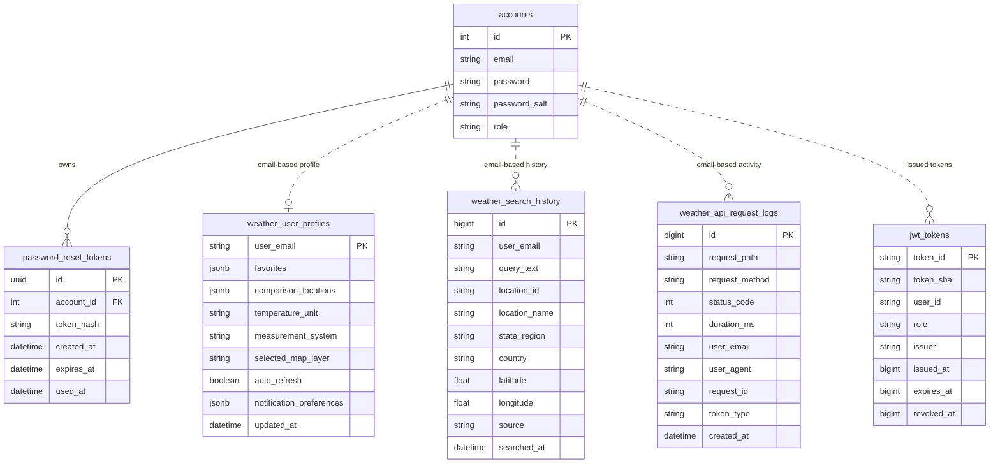

# Codyza Weather Database Schema

This repository currently persists data across three main areas:

1. account and password-reset data in the FastAPI registration database
2. weather profile, search history, and admin observability data in the NestJS PostgreSQL database
3. custom JWT token records for edge-function validation and revocation

## Entity relationship diagram

## Table details

### `accounts`

Stores end-user and administrator accounts.

Important columns:

- `email`
- `password`
- `password_salt`
- `role` with `user` or `admin`

### `password_reset_tokens`

Stores hashed, expiring, single-use reset tokens.

Important properties:

- one record per reset request
- `token_hash` is stored instead of the raw token
- `used_at` marks token consumption

### `weather_user_profiles`

Stores weather-specific user preferences and saved state:

- favorites
- comparison locations
- temperature unit
- measurement system
- selected map layer
- auto-refresh preference
- notification preferences

### `weather_search_history`

Stores recent searches for authenticated users. The service deduplicates by `(user_email, location_id)` and updates recency.

### `weather_api_request_logs`

Stores observability records used by the admin dashboard:

- request path and method
- status code
- duration
- user identity when available
- token type and request metadata

### `jwt_tokens`

Stores the custom JWT `jti` and `sha` claims so the gateway can validate that a token was issued by the system and revoke it on logout.

## Known gap

The current schema persists notification preferences, but it does not yet define a dedicated `notification_history` table. If final acceptance requires stored delivery history for outbound notifications, add a separate notification pipeline and persistence model.
